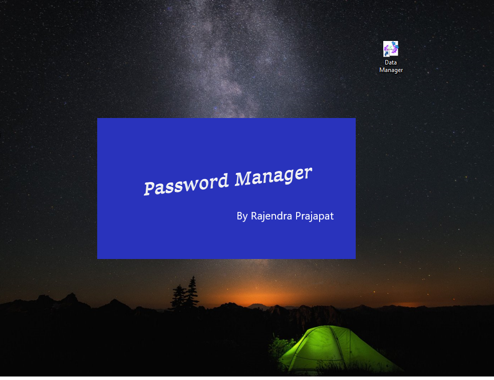
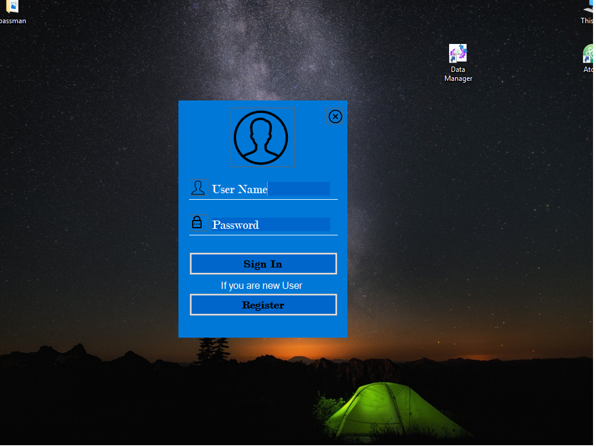
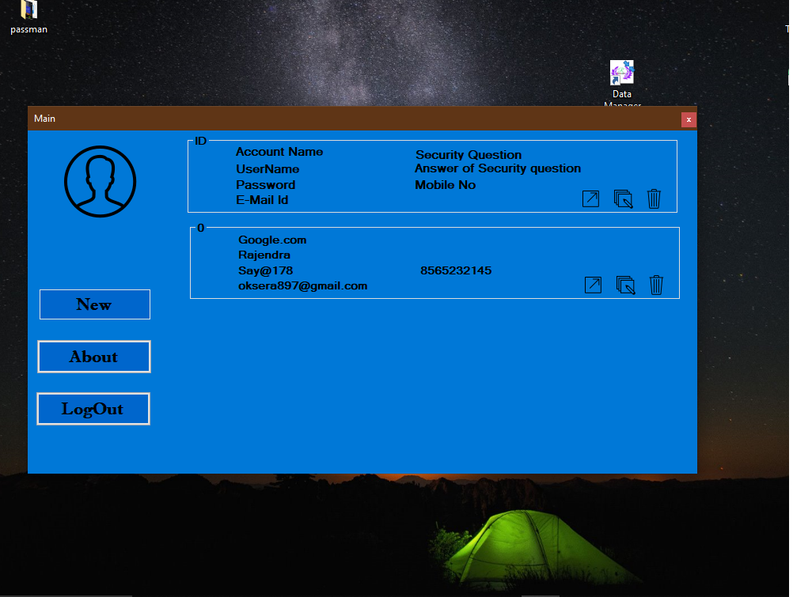

# Password-manager-windows-appliaction
This is a simple password manager. It takes password and other related fields from user and saves in the encrypted form into computer. It is a UI based application for windows developed using visual studio 2017 using c++.

  
  
  

<h1>How to use and edit This project</h1>
<ul>
 <li>To install application in windows</li>
 <ul>
  <li>clone or download the repo </li>
  <li>go to Password-manager-windows-appliaction/PassMan/Password_Manager/Debug/ </li>
  <li>Use any one file .exe or .msi to install </li>
</ul>
 <li>To modify the project </li>
  <ul>
    <li>clone or download the repo </li>
    <li>Download visual studio 2017 with cli and visual c++ support using https://visualstudio.microsoft.com/thank-you-downloading-visual-studio/?sku=Community&rel=15 </li>
    <li>go to Password-manager-windows-appliaction/PassMan/</li>
    <li>open PassMan.sln </li>
  </ul>
</ul>
